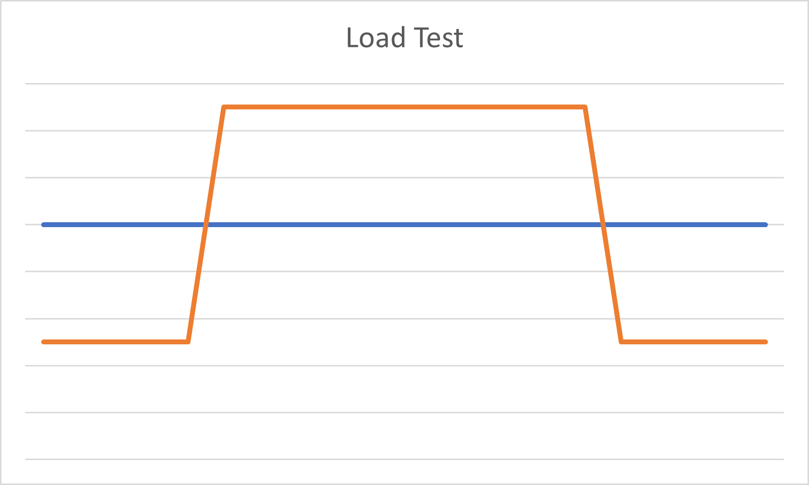
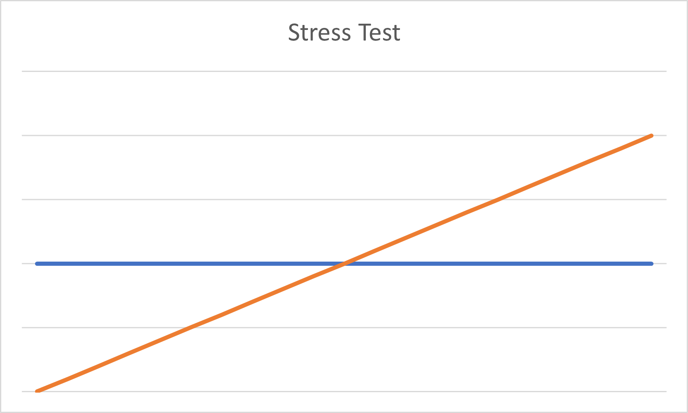
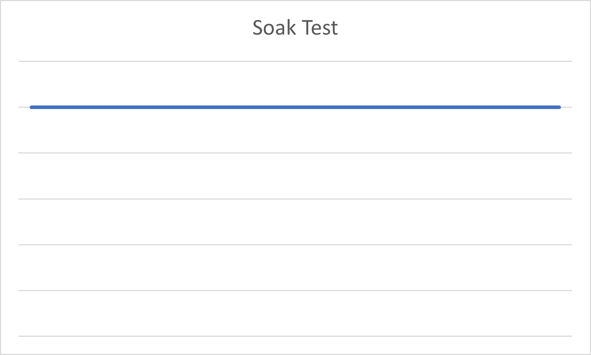
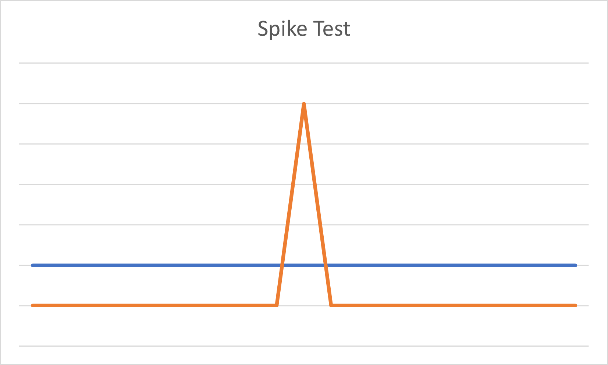
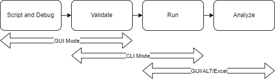
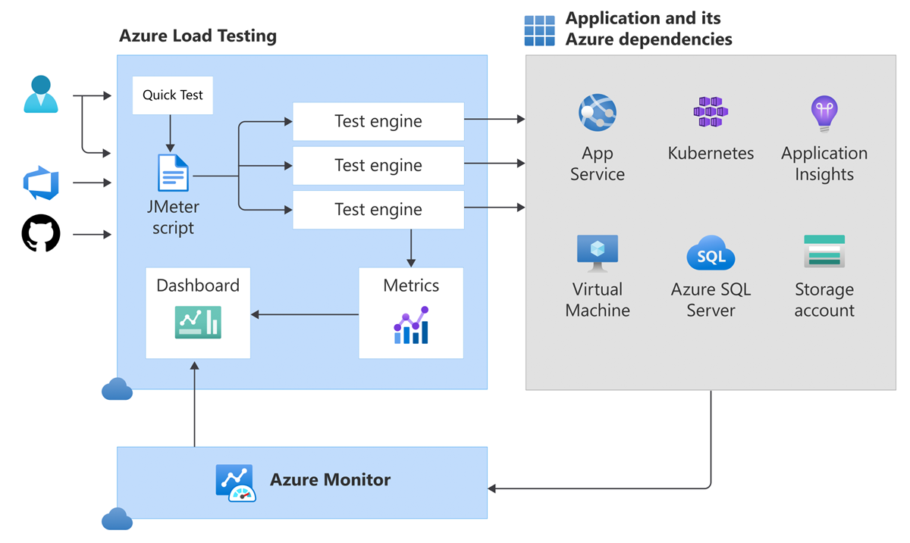

<!-- _footer: 'https://github.com/Codebytes/load-testing' -->

# Continuous Load Testing with GitHub Actions

# Chris Ayers 

---

## Chris Ayers
### Senior Customer Engineer Microsoft

<i class="fa-brands fa-twitter"></i> Twitter: @Chris\_L\_Ayers
<i class="fa-brands fa-mastodon"></i> Mastodon: @Chrisayers@hachyderm.io
<i class="fa-brands fa-linkedin"></i> LinkedIn: - [chris\-l\-ayers](https://linkedin.com/in/chris-l-ayers/)
<i class="fa fa-window-maximize"></i> Blog: [https://chris-ayers\.com/](https://chris-ayers.com/)
<i class="fa-brands fa-github"></i> GitHub: [Codebytes](https://github.com/codebytes)

---

# Agenda

- **What is Load Testing?**
- **What is JMeter?**
- **Infrastructure as Code (IaC) and Continuous Load Testing**
- **Benefits of Shift-Left Load Testing**
- **Conclusion and Q&A**

--- 

# What is Load Testing?

- Evaluating an application, system, or network performance under specific load conditions or increasing levels of load
- Helps identify bottlenecks, ensure reliability, and verify capacity
- Involves simulating real-world usage scenarios and gradually increasing load to observe system behavior

---

# Types of Load Tests

---

# Key Concepts of Load Testing

- **Virtual users:** Simulate concurrent connections to mimic real-world user traffic
- **Ramp-up time:** Time taken to reach the full number of virtual users
- **Response time:** Time from sending a request to receiving the last response
- **Latency:** Time from sending a request to receiving the first response
- **Requests per second (RPS):** Total number of requests generated per second during the test 
> RPS = (number of requests) / (total time in seconds)
> Virtual users = (RPS) * (latency in seconds)

---

# What is JMeter?

- Apache open-source load testing tool
- Java-based and supported on all major platforms
- One of the most popular load testing tools with a large user community

---

# JMeter Capabilities

- Supports a wide range of protocols, including:
  - HTTP
  - SOAP
  - LDAP
  - SMTP
  - JDBC
- Provides an IDE for building and debugging load tests (GUI mode)
- Offers a CLI for executing load tests at scale (non-GUI mode)
- Includes integrated reporting and analysis tools

---

# JMeter Limitations

- JMeter does not function as a browser:
  - It cannot execute JavaScript or render HTML/CSS
- As a result, JMeter's response times may not accurately reflect real-world browser response times
- Consider using browser-based testing tools or integrating browser metrics for a more accurate representation of user experience

---

# JMeter Workflow

- Plan 
- Record/Script/Debug 
- Customize parameters and settings
- Validate and run the test

---

# JMeter Testing Architecture

flowchart LR
style Dev fill:#00aaff,stroke:#000000,stroke-width:2px
style M fill:#00ffaa,stroke:#000000,stroke-width:2px
style T fill:#00ffaa,stroke:#000000,stroke-width:2px
style Node1,Node2,Node3,Node4 fill:#00ffaa,stroke:#000000,stroke-width:2px
Dev --Write Script--> M[Controller]
M-->Node1-->T[Target Server]
M-->Node2-->T
M-->Node3-->T
M-->Node4-->T

---

# Manual Testing vs Testing in Pipelines

## Manual Testing

- **Time-consuming**
- **Prone to human error**
- **Inconsistent**
- **Limited scalability**

## Testing in Pipelines

- **Automated**
- **Consistent**
- **Scalable**
- **Integrated with development processes**

---

# Azure Load Testing Service

- JMeter: Open-source, extensible load testing tool
- Azure Load Testing Service: Scalable, cloud-based platform for running JMeter tests
- Combines the power of JMeter with the scalability and reliability of Azure

---

# Azure Load Testing Service

---

# Utilizing Azure Load Testing Service

- Upload JMeter test plan to Azure
- Configure test duration, load pattern, and number of users
- Monitor test progress and analyze results

---

# Infrastructure as Code (IaC)

- IaC: Managing and provisioning infrastructure through code
- Enhances repeatability, consistency, and scalability
- Popular tools: Terraform, ARM Templates, Bicep Templates

---

# Continuous Load Testing on GitHub Actions

- GitHub Actions: Platform for automation and CI/CD
- Automate load testing as part of your development process
- Run tests against ephemeral environments created using IaC

---

# Benefits of Shift-Left Load Testing

- Early identification of performance bottlenecks
- Improved collaboration between developers, testers, and operations
- Reduced costs and increased confidence in solutions
- Faster feedback loop and shorter time to market

---

# Demos

---

# Questions

---

# Resources 

## Links

- [https://docs.microsoft.com/en-us/events/learntv/learnlive-iac-and-bicep/](https://docs.microsoft.com/en-us/events/learntv/learnlive-iac-and-bicep/)
- [https://github.com/codebytes](https://github.com/codebytes)

## Chris Ayers 

<i class="fa-brands fa-twitter"></i> Twitter: @Chris\_L\_Ayers
<i class="fa-brands fa-mastodon"></i> Mastodon: @Chrisayers@hachyderm.io
<i class="fa-brands fa-linkedin"></i> LinkedIn: - [chris\-l\-ayers](https://linkedin.com/in/chris-l-ayers/)
<i class="fa fa-window-maximize"></i> Blog: [https://chris-ayers\.com/](https://chris-ayers.com/)
<i class="fa-brands fa-github"></i> GitHub: [Codebytes](https://github.com/codebytes)

